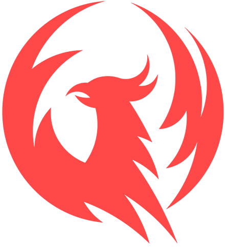

<p align="center">
  
</p>
<p align="center">
    
</p>

# @sport - Ws Client

WebSocket client. Provides real-time updates directly to your database, resulting in faster loading time.

## Installation

Install dependencies:

```
npm install
```

### Start

Launch the client with following command:

```
npm run client http://localhost
```

`http://localhost` in this example is your server URL. You can use your domain: `https://example.com`.

###

---

Developed by [Phoenix Gambling](https://phoenix-gambling.com).
